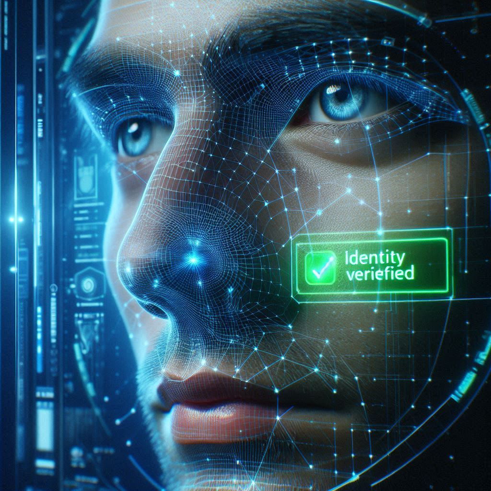

# 👁️ Biometric Authentication System (FaceSearch)

> **A privacy-focused, offline-capable Facial Recognition system built to replace traditional passwords with AI biometrics.**



## 📖 About
FaceSearch is a robust biometric authentication solution designed for security and privacy. Unlike cloud-based solutions, this system processes all biometric embeddings locally, ensuring user data never leaves the server. It features a decoupled microservice architecture, allowing the Python "Brain" to communicate seamlessly with any frontend (React, Mobile, Web) via REST APIs.

## 🚀 Key Features

*   **1:N Face Search:** Instantly identifies users from a database of known identities using Vector Search (Cosine Similarity).
*   **Anti-Spoofing (Liveness):** Prevents photo attacks by analyzing facial micro-expressions (requires a smile/reaction) in real-time.
*   **Security Logs:** Automatically captures and timestamps photos of unauthorized access attempts.
*   **Microservice Architecture:** Powered by **FastAPI** to serve biometric data to any frontend.
*   **Privacy First:** No third-party cloud APIs. Total data sovereignty.

---

## 🛠️ Installation & Setup

### 1. Clone the Repository
```bash
git clone https://github.com/AmosQuety/FaceSearch.git
cd FaceSearch
```

### 2. Set up the Python Environment
It is recommended to use a virtual environment to manage dependencies.

**Windows:**
```bash
python -m venv myenv
.\myenv\Scripts\activate
```

**Mac/Linux:**
```bash
python3 -m venv myenv
source myenv/bin/activate
```

### 3. Install Dependencies
```bash
pip install -r requirements.txt
```

### 4. ⚠️ Crucial Step: Create the Database Folder
Since biometric data is private, the database folder is excluded from the repository via `.gitignore`. You must create it manually.

1.  Create a folder named `known_faces` in the root directory.
2.  (Optional) Add a photo of yourself inside it. Name the file `Your_Name.jpg`.

**Your project structure should look like this:**
```text
FaceSearchProject/
├── assets/              <-- Stores README images (public)
├── known_faces/         <-- Create this! (Stores biometric data)
│   └── Tony_Stark.jpg   <-- Drop user images here
├── security_logs/       <-- Auto-generated by system
├── api.py
├── main.py
└── requirements.txt
```

---

## 🏃‍♂️ How to Run

You can run this project in two modes: **Dashboard Mode** (for testing/admin) or **API Mode** (for mobile/frontend integration).

### Option A: The Dashboard (Streamlit)
*Best for testing face recognition and adding users via a UI.*

```bash
streamlit run main.py
```
*   **Access:** Open your browser to `http://localhost:8501`.
*   **Usage:** Go to the **Admin Panel** tab to enroll faces, then test them in the **Live Gate** tab.

### Option B: The API (FastAPI)
*Best for connecting to React, React Native, or other frontends.*

```bash
uvicorn api:app --reload --port 8000
```
*   **Docs:** Go to `http://127.0.0.1:8000/docs` to view Swagger UI and test endpoints.

**API Endpoints:**
*   `POST /register`: Upload a photo to enroll a user.
*   `POST /verify`: Upload a selfie to verify identity (includes liveness check).

---

## 📱 Mobile Testing (Optional)
To test the camera functionality on your mobile phone, you need to expose your local server to the internet.

1.  Download and install **ngrok**.
2.  Run the Streamlit app: `streamlit run main.py`
3.  In a new terminal, run:
    ```bash
    ./ngrok http 8501
    ```
4.  Copy the `https` link provided by ngrok and open it on your phone's browser.

---

## 🛡️ Privacy & Security Note
*   **Git Ignore:** The `known_faces` directory is added to `.gitignore` to prevent accidental upload of private biometric data.
*   **Assets:** Public images (like screenshots for this README) are stored in the `assets/` folder.

## 🤝 Contributing
Pull requests are welcome. For major changes, please open an issue first to discuss what you would like to change.

## 📜 License
[MIT](https://choosealicense.com/licenses/mit/)
```